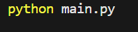
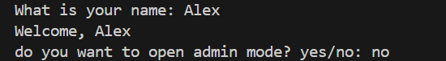
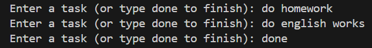
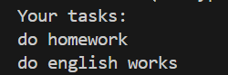

# Personal Task Manager


## Description

Personal Task Manager is a simple command-line application written in Python. It helps users manage their personal tasks by adding, viewing, and tracking tasks.

## Table of Contents

* [Features](#features)
* [Project Structure](#project-structure)
* [File Description](#file-description)
* [Requirements](#requirements)
* [Installation](#installation)
* [Environment Setup](#environment-setup)
* [Usage](#usage)
* [Example Output](#example-output)
* [Screenshot](#screenshot)
* [Demo](#demo)
* [Roadmap](#roadmap)
* [Contributing](#contributing)
* [License](#license)
* [Author](#author)

## Features

* Add new tasks
* View saved tasks
* Track task status
* Store tasks in a text file
* Simple command-line interface

## Project Structure

```text
│   .env.example
│   .gitignore
│   main.py
│   README.md
│   requirements.txt
│   tasks.py
│   tasks.txt
```

## File Description

| File or Folder | Description                       |
| -------------- | --------------------------------- |
| `main.py`      | Main program                      |
| `tasks.txt`    | Stores task data                  |
| `.env.example` | Example environment configuration |
| `.gitignore`   | Lists files Git should 

## Requirements

* Python 3.13 or compatible Python 3 version
* Git
* Visual Studio Code (recommended)

## Installation
1. open a terminal in project folder
2. check that python is installed:
```bash
python --version
```
3. install the python packages:
```bash
pip install -r requirements.txt
```

## Environment Setup
1. Create a `.env` file based on `.env.example`:

```bash
cp .env.example .env
```
2. open the new  `.env` file
3. replace the example password with your own password
```text
TASK_MANAGER_ADMIN_PASSWORD=your_password_here
```
4. save the file
> Do not commit your `.env` file because it may contain private information
## Usage

Run the program:

```bash
python main.py
```

Follow the instructions displayed in the terminal to manage your tasks.

## Example Output

```text

What is your name: hamidreza
Welcome, hamidreza
do you want to open admin mode? yes/no: no
Enter a task (or type done to finish): do homework
Enter a task (or type done to finish): done
Your tasks:
do homework

```

*The exact output depends on the implemented version of the program.*

## Screenshot

### start game


### Enter name and admin mode


### tasks


### show tasks


## Gifs demo


## Roadmap

* [x] Basic task management
* [ ] Add task priorities
* [ ] Improve input validation
* [ ] Add more task management features


## Contributing

## License

## Author

